# РОССИЙСКИЙ УНИВЕРСИТЕТ ДРУЖБЫ НАРОДОВ ИМЕНИ ПАТРИСА ЛУМУМБЫ 
## Факультет физико-математических и естественных наук  

### ОТЧЁТ  
### ПО ЛАБОРАТОРНОЙ РАБОТЕ №2  
**Тема**: «Система контроля версий Git»

**Выполнил студент 1 курса**:  
Чубаев Кирилл Евгеньевич  
Группа: НММбд-04-24  

**Москва, 2024 г.**

---

### Цель работы
Изучить идеологию и применение средств контроля версий, а также приобрести практические навыки по работе с системой Git.

### Программное обеспечение
- Виртуальная машина с ОС Ubuntu Linux версии 25.4 на основе командной строки GNU Linux.
- Система контроля версий Git.
- Сайт для работы с Git (github.com).

---

### Ход выполнения лабораторной работы

#### 2.4.1. Базовая настройка Git
- Я создал учётную запись на сайте github.com.

#### 2.4.2. Базовая настройка git
1. Я открыл терминал и указал имя и email владельца репозитория.

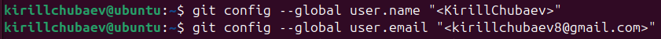

2. Далее настроил utf-8 в выводе сообщений git, задал имя начальной ветки, ввёл параметры `autocrlf` и `safecrlf`.

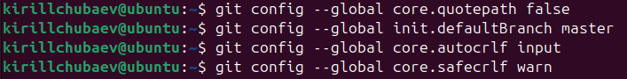

#### 2.4.3. Создание SSH-ключа
1. Я сгенерировал пару ключей, которые сохранились в каталоге `~/.ssh/`.

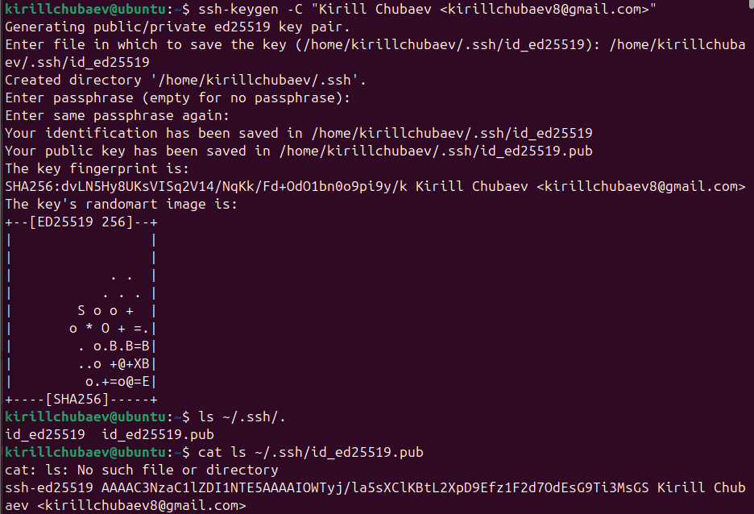

2. Далее загрузил сгенерированный открытый ключ на GitHub.

#### 2.4.4. Создание рабочего пространства и репозитория курса на основе шаблона
- Я создал каталог для предмета «Архитектура компьютера».

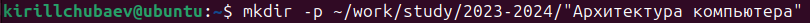

#### 2.4.5. Создание репозитория курса на основе шаблона
1. Перейдя на страницу репозитория с шаблоном курса [course-directory-student-template](https://github.com/yamadharma/course-directory-student-template), я начал создавать репозиторий через сайт GitHub. Я выбрал вкладку «Use this template», задал имя репозитория `study_2023–2024_arhpc` и создал репозиторий.

2. Далее в терминале я перешёл в каталог курса и клонировал созданный репозиторий, скопировав ссылку для клонирования на странице созданного репозитория.

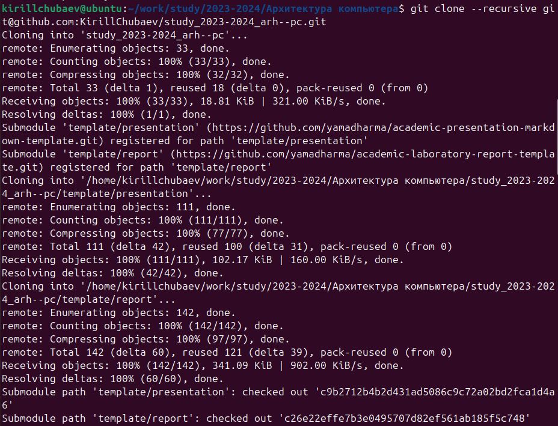

#### 2.4.6. Настройка каталога курса
1. Я удалил лишний файл `package.json` с помощью команды `rm`. Затем создал дополнительные каталоги.

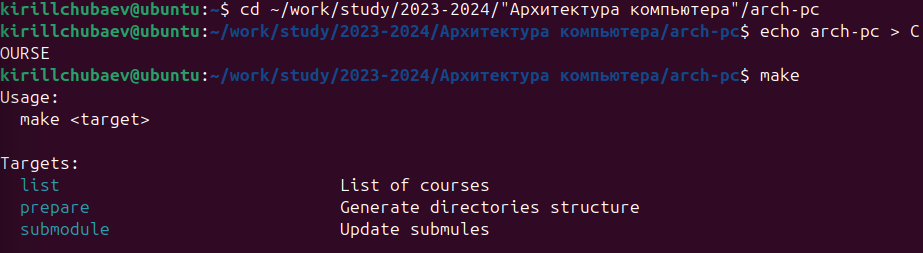

2. Далее я отправил файлы на сервер GitHub и проверил правильность создания иерархии рабочего пространства в локальном репозитории и на странице GitHub.

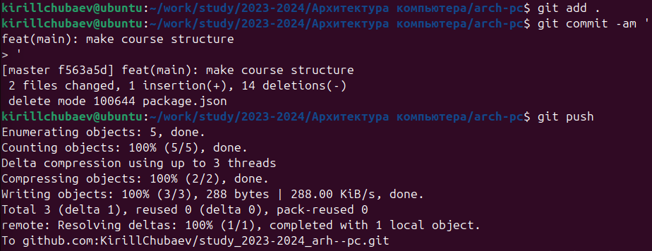

---

### Выполнение самостоятельной работы
- Я создал отчёт по выполнению лабораторной работы в соответствующем каталоге рабочего пространства.
- Для того чтобы прикрепить отчёт по лабораторной работе №1 на GitHub, сначала я перешел в соответствующий подкаталог.

- Далее я скопировал свою первую лабораторную работу и поместил её в каталог `lab1`.

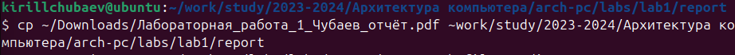
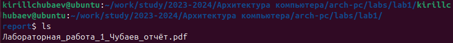

- Загрузил эту работу на GitHub и проверил её наличие в моем репозитории.

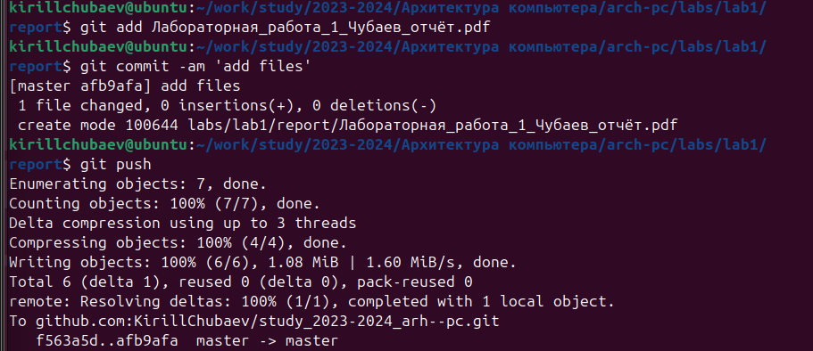

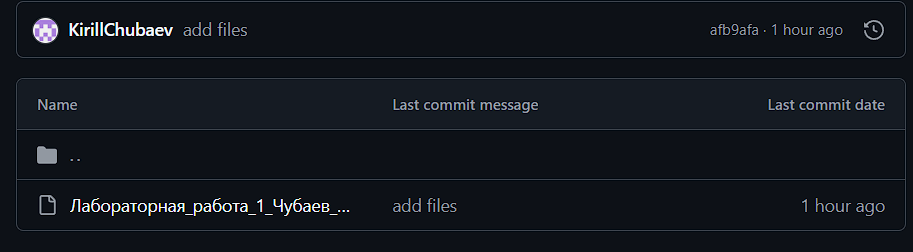

- После написания отчёта по лабораторной работе №2 загрузил её в репозиторий соответствующим образом.

---

### Вывод
Я изучил идеологию и применение средств контроля версий. Помимо этого, я получил полезные практические навыки по работе с системой Git.
