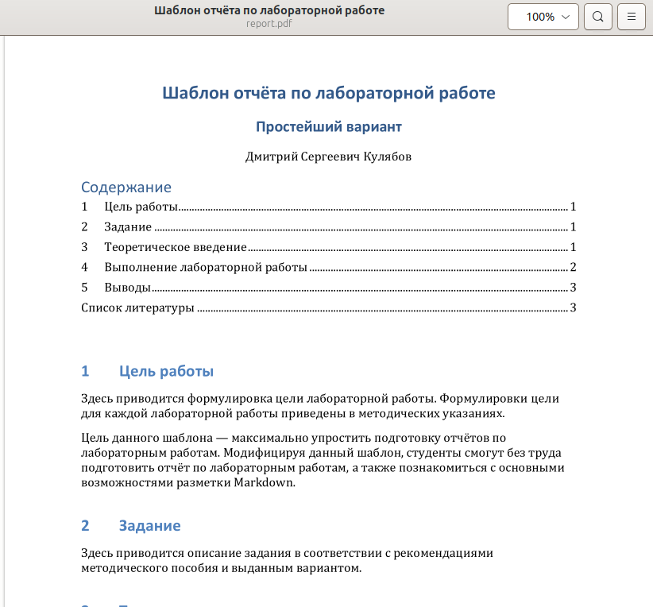
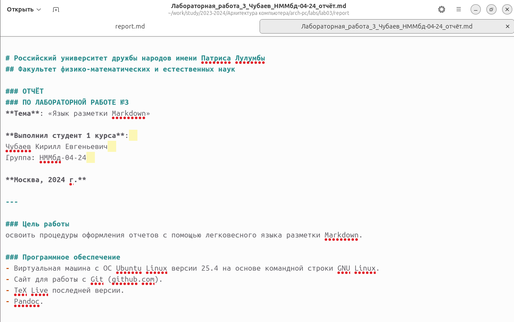

# Российский университет дружбы народов имени Патриса Лулумбы  
## Факультет физико-математических и естественных наук  

### ОТЧЁТ  
### ПО ЛАБОРАТОРНОЙ РАБОТЕ №3  
**Тема**: «Язык разметки Markdown»

**Выполнил студент 1 курса**:  
Чубаев Кирилл Евгеньевич  
Группа: НММбд-04-24  

**Москва, 2024 г.**

---

### Цель работы
освоить процедуры оформления отчетов с помощью легковесного языка разметки Markdown.

### Программное обеспечение
- Виртуальная машина с ОС Ubuntu Linux версии 25.4 на основе командной строки GNU Linux.
- Сайт для работы с Git (github.com).
- TeX Live последней версии.
- Pandoc.

---

### Ход выполнения лабораторной работы

1. Я открыл терминал.
2. Перешел в каталог курса, сформированный при выполнении лабораторной работы №2, и обновил локальный репозиторий.

3. Перешел в каталог с шаблоном отчета по лабораторной работе №3.

4. Далее провёл компиляцию шаблона с использованием Makefile. Для этого ввёл команду `make`.

5. Компиляция прошла успешно, сгенерировались файлы `report.docx` и `report.pdf`.

6. Проверил корректность полученных файлов.

7. Удалил полученные файлы с использованием Makefile с помощью команды `make clean`.

8. Открыл файл `report.md` с помощью текстового редактора `gedit`.

9. Далее внимательно изучил структуру файла и начал делать отчёт с использованием Markdown. Остальные шаги выполнения лабораторной работы прикреплены в документе в ТУИС.

---

