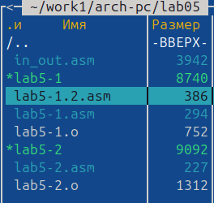
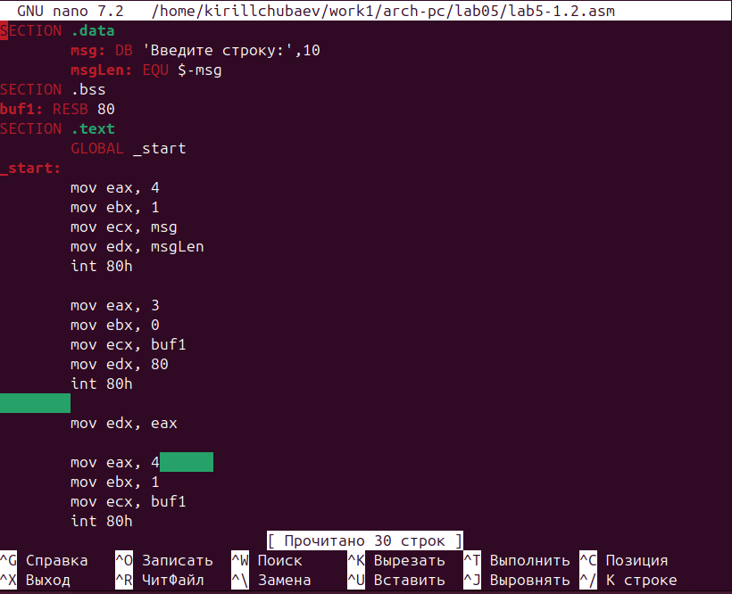
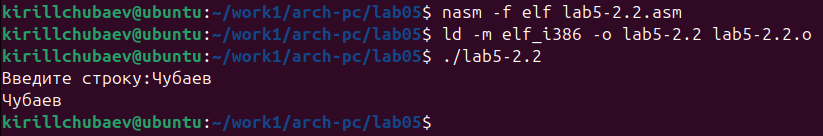

---
## Front matter
title: "Российский университет дружбы народов имени Патриса Лумумбы"
title: "Отчёт по лабораторной работе №5"
subtitle: "По теме: "Основы работы с Midnight Commander (mc). Структура программы на языке ассемблера NASM. Системные вызовы в ОС GNU Linux."
author: "Выполнил: Чубаев Кирилл Евгеньевич, НММбд-04-24"

## Generic otions
lang: ru-RU
toc-title: "Содержание"

## Bibliography
bibliography: bib/cite.bib
csl: pandoc/csl/gost-r-7-0-5-2008-numeric.csl

## Pdf output format
toc: true # Table of contents
toc-depth: 2
lof: true # List of figures
lot: true # List of tables
fontsize: 14pt
linestretch: 1.5
papersize: a4
documentclass: scrreprt
## I18n polyglossia
polyglossia-lang:
  name: russian
  options:
	- spelling=modern
	- babelshorthands=true
polyglossia-otherlangs:
  name: english
## I18n babel
babel-lang: russian
babel-otherlangs: english
## Fonts
mainfont: Times New Roman
romanfont: Times New Roman
sansfont: Times New Roman
monofont: Times New Roman
mathfont: Times New Roman
mainfontoptions: Ligatures=Common,Ligatures=TeX,Scale=0.94
romanfontoptions: Ligatures=Common,Ligatures=TeX,Scale=0.94
sansfontoptions: Ligatures=Common,Ligatures=TeX,Scale=MatchLowercase,Scale=0.94
monofontoptions: Scale=MatchLowercase,Scale=0.94,FakeStretch=0.9
mathfontoptions:
## Biblatex
biblatex: true
biblio-style: "gost-numeric"
biblatexoptions:
  - parentracker=true
  - backend=biber
  - hyperref=auto
  - language=auto
  - autolang=other*
  - citestyle=gost-numeric
## Pandoc-crossref LaTeX customization
figureTitle: "Рис."
tableTitle: "Таблица"
listingTitle: "Листинг"
lofTitle: "Список иллюстраций"
lotTitle: "Список таблиц"
lolTitle: "Листинги"
## Misc options
indent: true
header-includes:
  - \usepackage{indentfirst}
  - \usepackage{float} # keep figures where there are in the text
  - \floatplacement{figure}{H} # keep figures where there are in the text
---

# Цель работы

Целью данной лабораторной работы является приобретение практических навыков работы в Midnight Commander, а также освоение инструкций
языка ассемблера mov и int.

# Ход выполнения лабораторной работы:

1. Я ввел команду mc в терминале. Открылся Midnight Commander

2. Перешёл в каталог ~/work1/arch-pc. С помощью клавиши F7 я создал папку lab05 и перешел в неё:

3. Далее создал файл lab5-1.asm с помощью команды touch. С помощью клавиши F4 я открыл созданный файл для редактирования во встроенном редакторе nano:

4. Далее я ввёл текст программы из листинга 5.1, сохранил изменения и закрыл файл:

5. С помощью клавиши F3 я просмотрел файл lab5-1.asm

6. Я оттранслировал текст программы в объектный файл. Далее выполнил компоновку объектного файла и запустил получившийся исполняемый файл. Программа вывела строку "Введите строку" и ожидала ввода с клавиатуры. На запрос я ввёл свои ФИО:

7. Я скачал файл in_out.asm со страницы курса в ТУИС. Далее я скопировал загруженный файл в каталог с файлом lab5-1.asm с помощью клавиши F5:

8.  С помощью клавиши F6 я создал копию файла lab5-1.asm под названием lab5-2.asm:

9. Далее исправил текст программы в файле lab5-2.asm с использованием подпрограмм из внешнего файла in_out.asm в соответствии с листингом 5.2. Создал исполняемый файл и проверил его работу

10. В файле lab5-2.asm я заменил подпрограмму sprintLF на sprint. Далее создал исполняемый файл и проверил его работу.

Разница выполнения программы в том, что подпрограмма sprint ожидает ответа от пользователя на той же строке, где и было выведено "Введите строку", а подпрограмма sprintLF ожидает ответа от пользователя уже на следующей строке.

# Выполнение самостоятельной работы:

1. Я создал копию файла lab5-1.asm под названием lab5-1.2.asm. Далее я внёс изменения в программу, так чтобы она работала по алгоритму, указанному в задании:

2. Далее я получил исполняемый файл и проверил его работу. НА приглашение ввести строку я ввёл свою фамилию. Измененная программа вывела в терминал ранее введённую мною строку:

3. По аналогичному принципу я создал копию файла lab5-2.asm под названием lab5-2.2.asm. Далее внёс необходимые изменения в файл, чтобы он выводил введённую ранее строку в терминал:

4. Я создал исполняемый файл и проверил работу измененной программы. Программа работает исправно.

# Вывод:

В ходе данной лабораторной работы я приобрёл полезные практические навыки работы в Midnight Commander. Помимо этого, я также освоил инструкции языка ассемблера mov и int.

# Список литературы:

1\. GDB: The GNU Project Debugger. — URL: https://www.gnu.org/software/gdb/.

2\. GNU Bash Manual. — 2016. — URL: https://www.gnu.org/software/bash/manual/.

3\. Midnight Commander Development Center. — 2021. — URL: https://midnight-commander.org/.

4\. NASM Assembly Language Tutorials. — 2021. — URL: https://asmtutor.com/.

5\. *Newham C.* Learning the bash Shell: Unix Shell Programming. — O’Reilly Media, 2005. — 354 с. — (In a Nutshell). — ISBN 0596009658. — URL: http://www.amazon.com/Learningbash-Shell-Programming-Nutshell/dp/0596009658.

6\. *Robbins A.* Bash Pocket Reference. — O’Reilly Media, 2016. — 156 с. — ISBN 978-1491941591.

7\. The NASM documentation. — 2021. — URL: https://www.nasm.us/docs.php.

8\. *Zarrelli G.* Mastering Bash. — Packt Publishing, 2017. — 502 с. — ISBN 9781784396879.

9\. *Колдаев В. Д.*, *Лупин С. А.* Архитектура ЭВМ. — М. : Форум, 2018.

10\. *Куляс О. Л.*, *Никитин К. А.* Курс программирования на ASSEMBLER. — М. : Солон-Пресс, 2017.

11\. *Новожилов О. П.* Архитектура ЭВМ и систем. — М. : Юрайт, 2016.

12\. Расширенный ассемблер: NASM. — 2021. — URL: https://www.opennet.ru/docs/RUS/nasm/.

13\. *Робачевский А.*, *Немнюгин С.*, *Стесик О.* Операционная система UNIX. — 2-е изд. — БХВ-Петербург, 2010. — 656 с. — ISBN 978-5-94157-538-1.

14\. *Столяров А.* Программирование на языке ассемблера NASM для ОС Unix. — 2-е изд. — М. : МАКС Пресс, 2011. — URL: http://www.stolyarov.info/books/asm\_unix.

15\. *Таненбаум Э.* Архитектура компьютера. — 6-е изд. — СПб. : Питер, 2013. — 874 с. — (Классика Computer Science).

16\. *Таненбаум Э.*, *Бос Х.* Современные операционные системы. — 4-е изд. — СПб. : Питер, 2015. — 1120 с. — (Классика Computer Science).

