---
## Front matter
title: "Отчёт по лабораторной работе №6"
subtitle: "По теме: "Арифметические операции в NASM"
author: "Выполнил: Чубаев Кирилл Евгеньевич, НММбд-04-24"

## Generic otions
lang: ru-RU
toc-title: "Содержание"

## Bibliography
bibliography: bib/cite.bib
csl: pandoc/csl/gost-r-7-0-5-2008-numeric.csl

## Pdf output format
toc: true # Table of contents
toc-depth: 2
lof: true # List of figures
lot: true # List of tables
fontsize: 13pt
linestretch: 1.5
papersize: a4
documentclass: scrreprt
## I18n polyglossia
polyglossia-lang:
  name: russian
  options:
	- spelling=modern
	- babelshorthands=true
polyglossia-otherlangs:
  name: english
## I18n babel
babel-lang: russian
babel-otherlangs: english
## Fonts
mainfont: IBM Plex Serif
romanfont: IBM Plex Serif
sansfont: IBM Plex Sans
monofont: IBM Plex Mono
mathfont: STIX Two Math
mainfontoptions: Ligatures=Common,Ligatures=TeX,Scale=0.94
romanfontoptions: Ligatures=Common,Ligatures=TeX,Scale=0.94
sansfontoptions: Ligatures=Common,Ligatures=TeX,Scale=MatchLowercase,Scale=0.94
monofontoptions: Scale=MatchLowercase,Scale=0.94,FakeStretch=0.9
mathfontoptions:
## Biblatex
biblatex: true
biblio-style: "gost-numeric"
biblatexoptions:
  - parentracker=true
  - backend=biber
  - hyperref=auto
  - language=auto
  - autolang=other*
  - citestyle=gost-numeric
## Pandoc-crossref LaTeX customization
figureTitle: "Рис."
tableTitle: "Таблица"
listingTitle: "Листинг"
lofTitle: "Список иллюстраций"
lotTitle: "Список таблиц"
lolTitle: "Листинги"
## Misc options
indent: true
header-includes:
  - \usepackage{indentfirst}
  - \usepackage{float} # keep figures where there are in the text
  - \floatplacement{figure}{H} # keep figures where there are in the text
---

# Цель работы

Целью данной лабораторной работы является освоение арифметических инструкций языка ассемблера NASM.

# Ход выполнения лабораторной работы:

6.3.1. Символьные и численные данные в NASM

1. Я создал каталог для работы с программами lab06, перешел в него и создал файл lab6-1.asm:

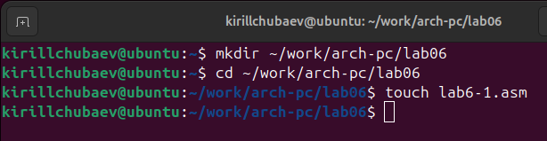
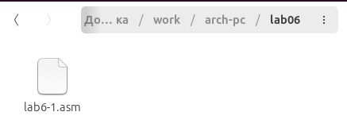

2. Далее перешел в созданный файл и ввёл текст программы из листинга 6.1. Программа должна выводить значения записанные в регистр eax:

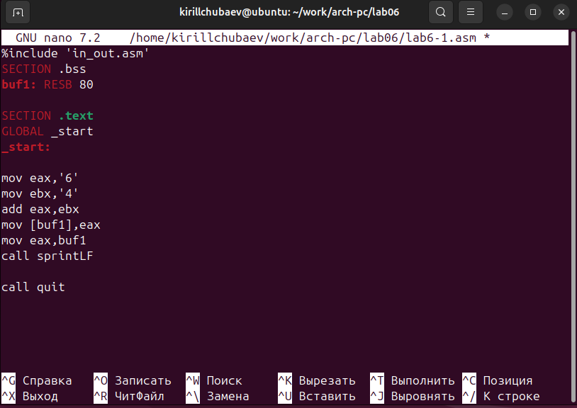

3. Создал исполняемый файл и запустил его:

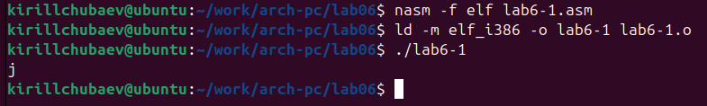

При выводе значения регистра eax мы ожидаем увидеть число 10. Однако результатом был символ j. Это произошло потому, что код символа 6 равен 00110110 в двоичном представлении (или 54 в десятичном представлении), а код символа 4 – 00110100, что в свою очередь является кодом символа j.

4. Далее я изменил текст программы, и вместо символов я записал в регистры числа.

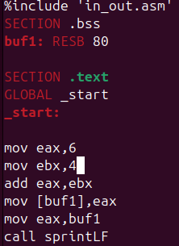

5. Создал исполняемый файл и запустил его:

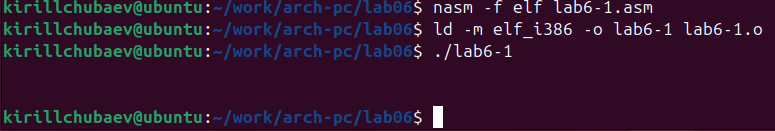

Как и в предыдущем примере число 10 не вывелось в терминале. Вывелся символ с кодом 10. Пользуясь таблицей ASCII из приложения 2 я определил, что число 10 равно символу "LF,\n". Этот символ не отображается при выводе на экран.

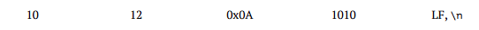

6. Я создал файл lab6-2.asm и ввел в него текст программы из листинга 6.2:

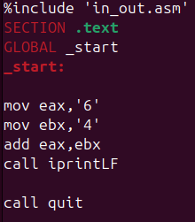
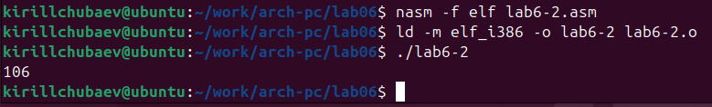

В результате работы программы я получил число 106. В данном случае, как и в первом, команда add складывает коды символов ‘6’ и ‘4’ (54+52=106). Однако, в отличии от программы из листинга 6.1, функция iprintLF позволяет вывести число, а не символ, кодом которого
является это число.

7. Аналогично предыдущему примеру я изменил символы на числа, заменив некоторые строки. Терминал вывел результат: "10":

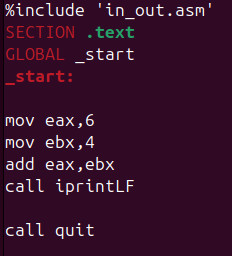
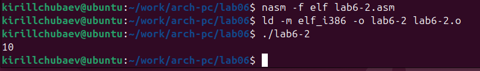

8. Я заменил функцию iprintLF на iprint. Создал исполняемый файл и запустил его. Отличие в том, что результат вывелся на одной строке вместе со строкой kirillchubaev@ubuntu: 

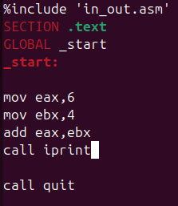
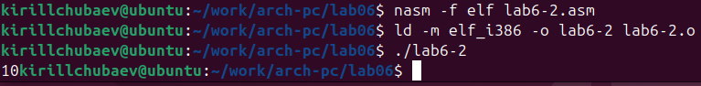

6.3.2. Выполнение арифметических операций в NASM

9.  Я создал файл lab6-3.asm. Далее с помощью листинга 6.3 я написал программу вычисления арифметического выражения f(x)=(5*2+3)/3:

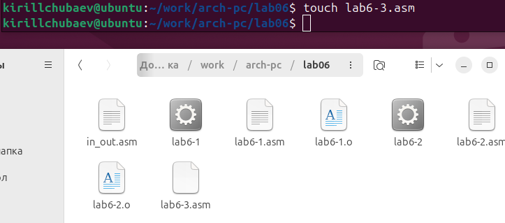
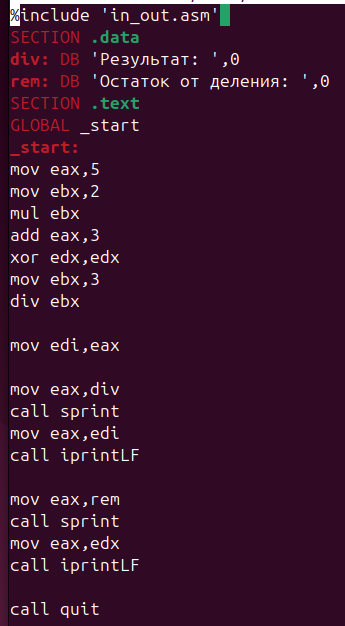

10. Далее создал исполняемый файл и запустил его. Результат работы получился следующим:

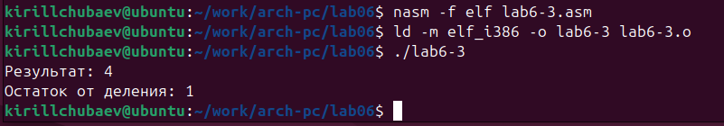

11. Аналогично я изменил текст программы для вычисления выражения f(x)=(4*6+2)/5. 

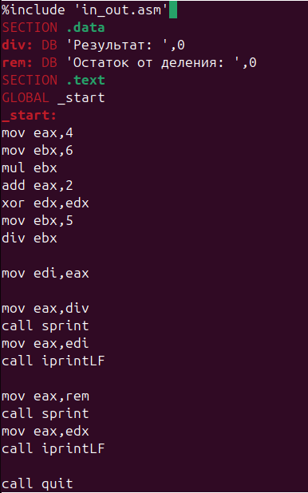

12. Потом создал исполняемый файл и запустил его. Результат получился следующим:

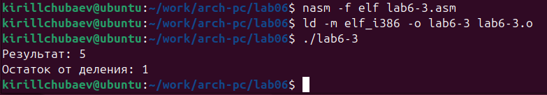

13. Я создал файл variant.asm для написания программы, которая вычисляет вариант задания по номеру студенческого билета. Далее я написал код самой программы с помощью листинга 6.4:

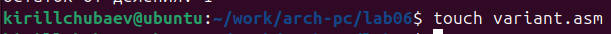
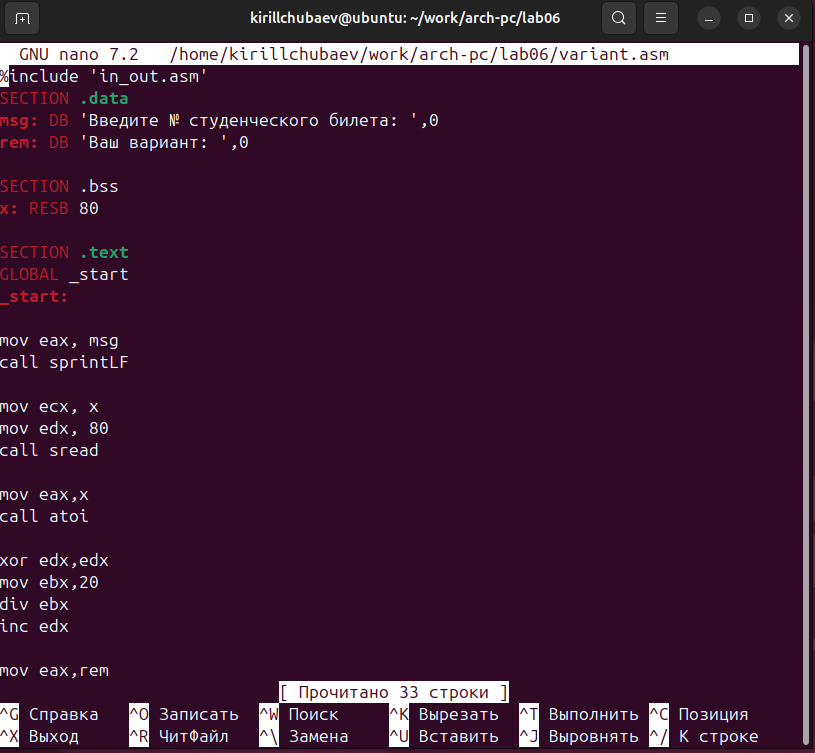

14. Я создал исполняемый файл и запустил его. В результате в терминале вывелось следующее:

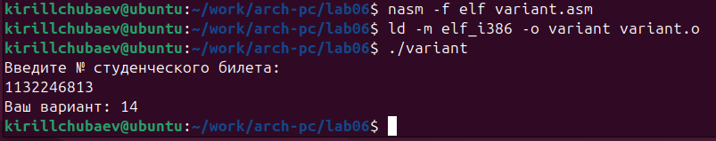

Мой вариант выполнения задания - 14.

Ответы на вопросы:

1) За вывод на экран сообщения "Ваш вариант:" отвечают следующие строки из листинга 6.4:

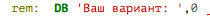

2) Строки
mov ecx, x
mov edx, 80
call sread
Отвечают за ожидание программы ответа ввода с клавиатуры пользователем.

3) Функция "call atoi" преобразовывает ASCII-код символа в целое число.

4) За вычисление варианта из листинга 6.4 отвечают следующие строки:

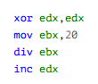

5) При выполнении инструкции "div ebx" остаток от деления в регистр edx.

6) Инструкция "inc edx" используется для увеличения регистра edx на 1.

7) За вывод на экран результата вычислений отвечают следующие строки из листинга 6.4:

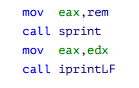
 
# Выполнение самостоятельной работы:

1. Для написания программы вычисления выражения y=f(x) я сначала узнал свой вариант задания. Мой вариант - 14, поэтому я должен написать программу для вычисления выражения f(x)=((x/2)+8)*3.

2. Далее я создал файл под названием lab6-4.asm для написания кода:

3. Далее я написал код вычисления необходимого выражения, используя некоторые инструкции из листинга 6.4:

Текст кода вычисления выражения:

%include 'in_out.asm'

SECTION .data

msg: DB 'Введите значение x: ',0

rem: DB 'Результат f(x): ',0

SECTION .bss

x: RESB 80

SECTION .text

GLOBAL _start

_start:

mov eax, msg

call sprintLF

mov ecx, x

mov edx, 80

call sread

mov eax,x

call atoi 

; Вычисление f(x) = ((x / 2) + 8) * 3

xor edx, edx

mov ebx, 2

div ebx ; eax = x / 2, edx = остаток от деления

add eax, 8

imul eax, 3

mov [x], eax

mov eax,rem

call sprint

mov eax,[x]

call iprintLF

call quit

4. Я создал исполняемый файл, запустил его и правильность его выполнения.

На ввод значения x я ввел число 1 и 4. Результат вычислений оказался корректным: 24 и 30. При выполнении деления в качестве результата программа использовала только целую часть от деления и не учитывала остаток, что и требовалась при выполнении задания.

# Вывод:

В ходе данной лабораторной работы я освоил полезные арифметические инструкции языка ассемблера NASM.

# Список литературы:

1\. GDB: The GNU Project Debugger. — URL: https://www.gnu.org/software/gdb/.

2\. GNU Bash Manual. — 2016. — URL: https://www.gnu.org/software/bash/manual/.

3\. Midnight Commander Development Center. — 2021. — URL: https://midnight-commander.org/.

4\. NASM Assembly Language Tutorials. — 2021. — URL: https://asmtutor.com/.

5\. *Newham C.* Learning the bash Shell: Unix Shell Programming. — O’Reilly Media, 2005. — 354 с. — (In a Nutshell). — ISBN 0596009658. — URL: http://www.amazon.com/Learningbash-Shell-Programming-Nutshell/dp/0596009658.

6\. *Robbins A.* Bash Pocket Reference. — O’Reilly Media, 2016. — 156 с. — ISBN 978-1491941591.

7\. The NASM documentation. — 2021. — URL: https://www.nasm.us/docs.php.

8\. *Zarrelli G.* Mastering Bash. — Packt Publishing, 2017. — 502 с. — ISBN 9781784396879.

9\. *Колдаев В. Д.*, *Лупин С. А.* Архитектура ЭВМ. — М. : Форум, 2018.

10\. *Куляс О. Л.*, *Никитин К. А.* Курс программирования на ASSEMBLER. — М. : Солон-Пресс, 2017.

11\. *Новожилов О. П.* Архитектура ЭВМ и систем. — М. : Юрайт, 2016.

12\. Расширенный ассемблер: NASM. — 2021. — URL: https://www.opennet.ru/docs/RUS/nasm/.

13\. *Робачевский А.*, *Немнюгин С.*, *Стесик О.* Операционная система UNIX. — 2-е изд. — БХВ-Петербург, 2010. — 656 с. — ISBN 978-5-94157-538-1.

14\. *Столяров А.* Программирование на языке ассемблера NASM для ОС Unix. — 2-е изд. — М. : МАКС Пресс, 2011. — URL: http://www.stolyarov.info/books/asm\_unix.

15\. *Таненбаум Э.* Архитектура компьютера. — 6-е изд. — СПб. : Питер, 2013. — 874 с. — (Классика Computer Science).

16\. *Таненбаум Э.*, *Бос Х.* Современные операционные системы. — 4-е изд. — СПб. : Питер, 2015. — 1120 с. — (Классика Computer Science).

