---
## Front matter
title: "Отчёт по лабораторной работе №7"
subtitle: "По теме: Команды безусловного и условного переходов в NASM. Программирование ветвлений."
author: "Выполнил: Чубаев Кирилл Евгеньевич, НММбд-04-24"

## Generic otions
lang: ru-RU
toc-title: "Содержание"

## Bibliography
bibliography: bib/cite.bib
csl: pandoc/csl/gost-r-7-0-5-2008-numeric.csl

## Pdf output format
toc: true # Table of contents
toc-depth: 2
fontsize: 12pt
linestretch: 1.5
papersize: a4
documentclass: scrreprt
## I18n polyglossia
polyglossia-lang:
  name: russian
  options:
	- spelling=modern
	- babelshorthands=true
polyglossia-otherlangs:
  name: english
## I18n babel
babel-lang: russian
babel-otherlangs: english
## Fonts
mainfont: PT Serif
romanfont: PT Serif
sansfont: PT Sans
monofont: PT Mono
mainfontoptions: Ligatures=TeX
romanfontoptions: Ligatures=TeX
sansfontoptions: Ligatures=TeX,Scale=MatchLowercase
monofontoptions: Scale=MatchLowercase,Scale=0.9
## Biblatex
biblatex: false
biblio-style: "gost-numeric"
biblatexoptions:
  - parentracker=true
  - backend=biber
  - hyperref=auto
  - language=auto
  - autolang=other*
  - citestyle=gost-numeric
## Pandoc-crossref LaTeX customization
figureTitle: "Рис."
tableTitle: "Таблица"
listingTitle: "Листинг"
lofTitle: "Список иллюстраций"
lotTitle: "Список таблиц"
lolTitle: "Листинги"
## Misc options
indent: true
header-includes:
  - \usepackage{indentfirst}
  - \usepackage{float} # keep figures where there are in the text
  - \floatplacement{figure}{H} # keep figures where there are in the text
---

# Цель работы

Целью данной лабораторной работы является изучение команд условного и безусловного переходов, приобретение навыков написания программ с использованием переходов, а также знакомство с назначением и структурой файла листинга.

# Выполнение лабораторной работы

1. Я создал каталог lab07 в директории "~/work/arch-pc". Далее создал файл lab7-1.asm внутри каталога:

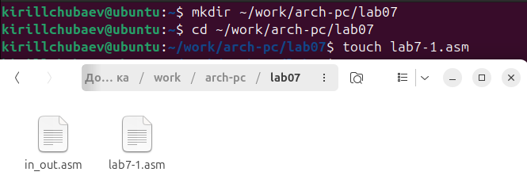

2. Далее ввел в файл текст программы из листинга 7.1:

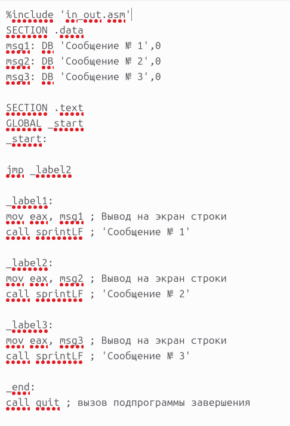

3. Я создал исполняемый файл и запустил его. Результат соответствовал нужному:

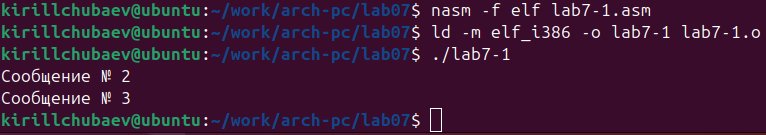

4. Я изменил текст программы с помощью листинга 7.2  таким образом, чтобы она сначала выводила ‘Сообщение № 2’, потом ‘Сообщение № 1’ и завершала работу. С помощью листинга 7.2 я написал код. Далее проверил его работу. На экран вывелся следующий результат:

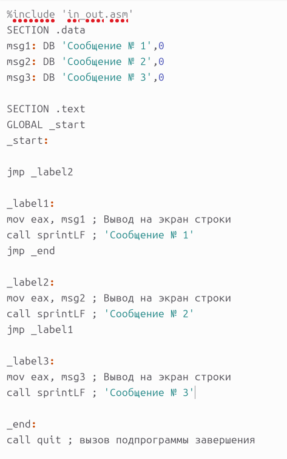
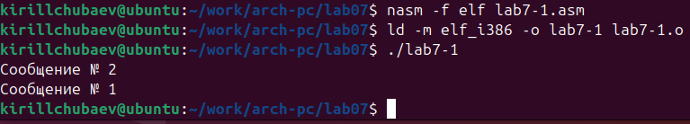

5. Я изменил текст программы так, чтобы сначала выводило 'Сообщение №3', затем 'Сообщение №2', затем 'Сообщение №1'.

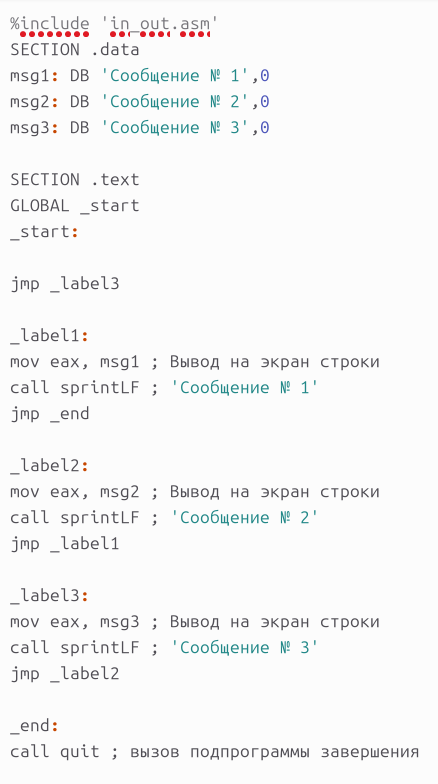

6. Далее запустил программу и проверил ее работу. Программа работает корректно. На экран вывелось следующее:

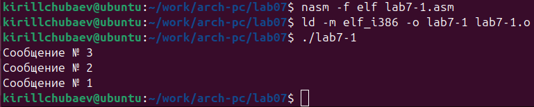

7. Я создал файл lab7-2.asm. Далее внимательно изучил текст программы из листинга 7.3 и написал текст программы:

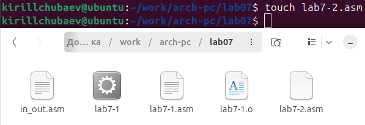
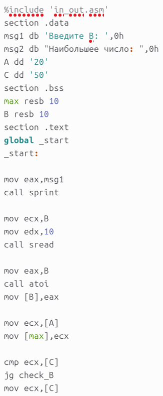
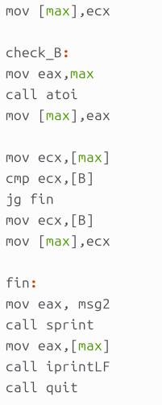

8. Я создал исполняемый файл и запустил программу. Далее ввел несколько разных чисел, чтобы проверить, как работает программа. Программа работает корректно:

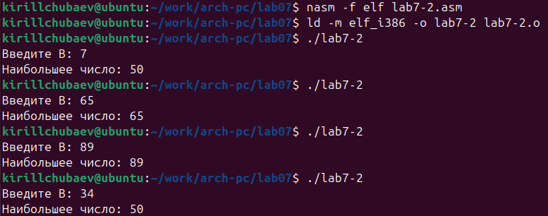

9. Я создал файл листинга lab7-2.lst и открыл его.

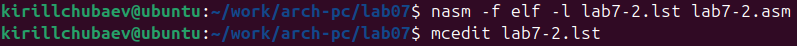

10. Проанализировав файл, я понял как он работает и какие значения выводит:

1) Эта строка находится на 21 месте, ее адрес "00000101", Машинный код - В8[0A000000], а "mov eax, B" - исходный текст программы, означающий, что в регистр eax мы вносим значения переменной B.

2) Эта строка находится на 35 месте, ее адрес - "00000135", Машинный код - E862FFFFFF, а функция "call atoi" - исходный текст программы, означающий, что символ, лежащий в строке выше, переводится в число.

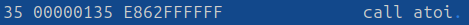

3) Эта строка находится на 47 месте, ее адрес - "00000163", Машинный код - A1[00000000], а "mov eax, [max]" - исходный текст программы, означающий, что число, хранившееся в переменной max, записывается в регистр eax.

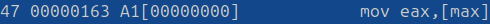

11. В строке "mov eax, max" я убрал "max" и попробовал создать файл. В терминале вывелась ошибка, так как для программа требует два операнда:

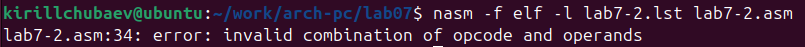

12. В файле листинга показывается, где именно ошибка и с чем она связана:

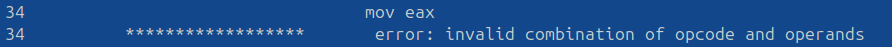

# Выполнение самостоятельной работы

1. Для выполнения первого задания самостоятельной работы я сначала создал файл lab7-test1.asm:

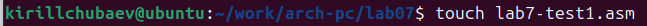

2. Далее я написал программу для нахождения наименьшего числа из трех введённых в терминал:

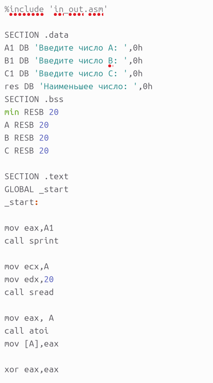
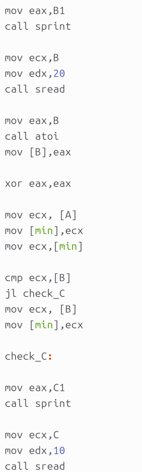
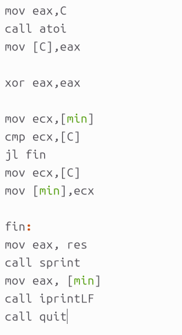

3. В лабораторной работе №6 я получил вариант 14, поэтому я должен ввести следующие числа: 81, 22, 72. Я создал исполняемый файл и запустил программу. Программа работает корректно и вывелся следующий результат:

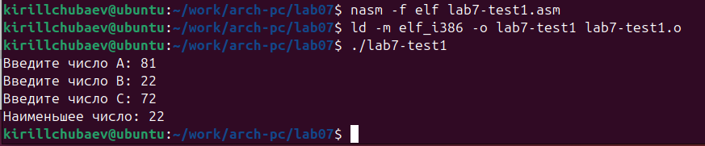

4. Для выполнения второго задания самостоятельной работы я создал файл lab7-test2.asm:

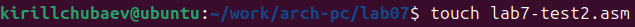

5. Далее я написал программу, чтобы она вычисляла необходимое выражение при введенных "a" и "x". Поскольку мой вариант - 14, то я написал код для вычисления выражения из 14 варианта:

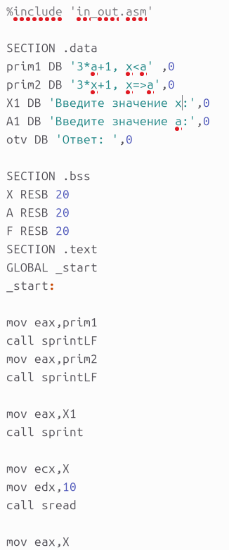
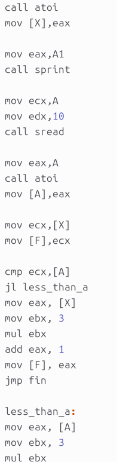
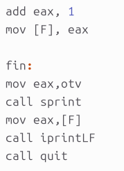

6. Я создал исполняемый файл и запустил программу. Далее ввёл необходимые значения "a" и "x" из варианта 14. Программа работает корректно и выводит правильные вычисления:

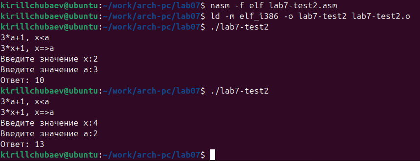

# Вывод

В ходе данной лабораторной работы я изучил команды условного и безусловного перехода, а также приобрел полезные навыки написания программ с переходами.

# Список литературы

1\. GDB: The GNU Project Debugger. — URL: https://www.gnu.org/software/gdb/.

2\. GNU Bash Manual. — 2016. — URL: https://www.gnu.org/software/bash/manual/.

3\. Midnight Commander Development Center. — 2021. — URL: https://midnight-commander.org/.

4\. NASM Assembly Language Tutorials. — 2021. — URL: https://asmtutor.com/.

5\. *Newham C.* Learning the bash Shell: Unix Shell Programming. — O’Reilly Media, 2005. — 354 с. — (In a Nutshell). — ISBN 0596009658. — URL: http://www.amazon.com/Learningbash-Shell-Programming-Nutshell/dp/0596009658.

6\. *Robbins A.* Bash Pocket Reference. — O’Reilly Media, 2016. — 156 с. — ISBN 978-1491941591.

7\. The NASM documentation. — 2021. — URL: https://www.nasm.us/docs.php.

8\. *Zarrelli G.* Mastering Bash. — Packt Publishing, 2017. — 502 с. — ISBN 9781784396879.

9\. *Колдаев В. Д.*, *Лупин С. А.* Архитектура ЭВМ. — М. : Форум, 2018.

10\. *Куляс О. Л.*, *Никитин К. А.* Курс программирования на ASSEMBLER. — М. : Солон-Пресс, 2017.

11\. *Новожилов О. П.* Архитектура ЭВМ и систем. — М. : Юрайт, 2016.

12\. Расширенный ассемблер: NASM. — 2021. — URL: https://www.opennet.ru/docs/RUS/nasm/.

13\. *Робачевский А.*, *Немнюгин С.*, *Стесик О.* Операционная система UNIX. — 2-е изд. — БХВ-Петербург, 2010. — 656 с. — ISBN 978-5-94157-538-1.

14\. *Столяров А.* Программирование на языке ассемблера NASM для ОС Unix. — 2-е изд. — М. : МАКС Пресс, 2011. — URL: http://www.stolyarov.info/books/asm\_unix.

15\. *Таненбаум Э.* Архитектура компьютера. — 6-е изд. — СПб. : Питер, 2013. — 874 с. — (Классика Computer Science).

16\. *Таненбаум Э.*, *Бос Х.* Современные операционные системы. — 4-е изд. — СПб. : Питер, 2015. — 1120 с. — (Классика Computer Science).

