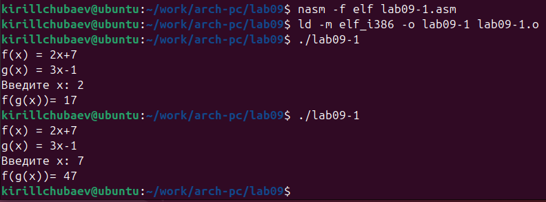

---
## Front matter
title: "Отчет по лабораторной работе №9"
subtitle: "По теме: Понятие подпрограммы. Отладчик GDB"
author: "Выполнил: Чубаев Кирилл Евгеньевич, НММбд-04-24"

## Generic otions
lang: ru-RU
toc-title: "Содержание"

## Bibliography
bibliography: bib/cite.bib
csl: pandoc/csl/gost-r-7-0-5-2008-numeric.csl

## Pdf output format
toc: true # Table of contents
toc-depth: 2
lof: true # List of figures
lot: true # List of tables
fontsize: 12pt
linestretch: 1.5
papersize: a4
documentclass: scrreprt
## I18n polyglossia
polyglossia-lang:
  name: russian
  options:
	- spelling=modern
	- babelshorthands=true
polyglossia-otherlangs:
  name: english
## I18n babel
babel-lang: russian
babel-otherlangs: english
## Fonts
mainfont: PT Serif
romanfont: PT Serif
sansfont: PT Sans
monofont: PT Mono
mainfontoptions: Ligatures=TeX
romanfontoptions: Ligatures=TeX
sansfontoptions: Ligatures=TeX,Scale=MatchLowercase
monofontoptions: Scale=MatchLowercase,Scale=0.9
## Biblatex
biblatex: false
biblio-style: "gost-numeric"
biblatexoptions:
  - parentracker=true
  - backend=biber
  - hyperref=auto
  - language=auto
  - autolang=other*
  - citestyle=gost-numeric
## Pandoc-crossref LaTeX customization
figureTitle: "Рис."
tableTitle: "Таблица"
listingTitle: "Листинг"
lofTitle: "Список иллюстраций"
lotTitle: "Список таблиц"
lolTitle: "Листинги"
## Misc options
indent: true
header-includes:
  - \usepackage{indentfirst}
  - \usepackage{float} # keep figures where there are in the text
  - \floatplacement{figure}{H} # keep figures where there are in the text
---

# Цель работы

Целью данной лабораторной работы является приобретение навыков написания программ с использованием подпрограмм, а также знакомство с методами отладки при помощи GDB и его основными возможностями

# Ход выполнения лабораторной работы

1. Сначала я создал каталог lab09 и создал файл lab09-1.asm:

2. Я ввел код программы из листинга 9.1 в созданный файл и запустил программу:

3. Далее я изменил код программы так, чтобы она решала выражение f(g(x)). Программа работает корректно:

4. Потом я создал файл lab09-2.asm и вписал туда код программы с помощью листинга 9.2:

5. Затем загрузил и запустил файл программы в отладчик gdb и поставил break-отметку на метку _start:

6. Я внимательно изучил дисассимплированный код программы, начиная с метки:

7. Далее с помощью специальных команд я переключился на intel'овское отображение синтаксиса:

Отличие заключается в том, что в диссамилированном отображении в командах используют символы "%" и "$", а в Intel'овском отображении эти символы не используются.

8. Потом я включил режим псевдографики для удобного анализа программы:

9. Я посмотрел наличие меток с помощью специальной команды и установил еще одну метку по адресу инструкции:

10. С помощью команды info registers я посмотрел содержимое регистров:

11. Далее посмотрел значение переменной msg1 по специальному имени:

12. Потом посмотрел значение второй переменной msg2 по адресу:

13. С помощью команды set я изменил значение переменной msg1:

14. По аналогичному принципу я изменил переменную msg2:

15. Затем я вывел значение регистра edx в двоичном, символьном и 16-ичном виде:

16. Я изменил значение регистра ebx следующим способом:

Команда выводит два разных значения, так как в первый раз вносится значение 2, а во втором случае регистр равен двум.

17. Я завершил работу с файлом в отладчике с помощью команд "c", "si", и "quit":

18. Далее я скопировал файл lab8-2.asm из лабораторной работы №8 и переименовал его. Запустил файл в отладчике, указал аргументы и запустил файл, поставив метку на _start:

19. Я проверил адрес вершины стека и убедился, что там хранится 5 элементов:

20. Затем я посмотрел все позиции стека:

По первому адресу хранится сам адрес, в остальных адресах хранятся элементы. Элементы расположены с интервалом в 4 единицы, так как стек может хранить только до 4 байт. Для того чтобы данные сохранялись нормально и без помех, компьютер использует новый стек для новой информации.

# Выполнение самостоятельной работы

1. Сначала я создал файл для выполнения первого задания самостоятельной работы под названием lab09-test1.asm:

2. Затем преобразовал свой код программы из лабораторной работы №8 и реализовал вычисления как подпрограмму:

3. Создал исполняемый файл и запустил его, чтобы проверить правильность выполнения программы. Программа работает исправно:

4. Для выполнения второго задания я создал файл lab09-test2.asm: 

5. С помощью листинга 9.3 я написал код необходимой программы. Потом создал исполняемый файл и запустил его:

6. После выявления ошибки, которая связана с неправильным вычислением программы, я запустил её в отладчике:

7. Затем я открыл регистры и внимательно проанализировал их. Я увидел, что некоторые регистры стоят не на своих местах и исправил это:

8. После изменения регистров я запустил программу. Программа стала работать корректно и вывела в терминале ответ "25":

# Вывод

В ходе выполнения данной лабораторной работы я приобрел полезные навыки написания программ с использованием подпрограмм. Помимо этого, я познакомился с методами отладки при помощи GDB и с его основными возможностями.

# Список литературы

1\. GDB: The GNU Project Debugger. — URL: https://www.gnu.org/software/gdb/.

2\. GNU Bash Manual. — 2016. — URL: https://www.gnu.org/software/bash/manual/.

3\. Midnight Commander Development Center. — 2021. — URL: https://midnight-commander.org/.

4\. NASM Assembly Language Tutorials. — 2021. — URL: https://asmtutor.com/.

5\. *Newham C.* Learning the bash Shell: Unix Shell Programming. — O’Reilly Media, 2005. — 354 с. — (In a Nutshell). — ISBN 0596009658. — URL: http://www.amazon.com/Learningbash-Shell-Programming-Nutshell/dp/0596009658.

6\. *Robbins A.* Bash Pocket Reference. — O’Reilly Media, 2016. — 156 с. — ISBN 978-1491941591.

7\. The NASM documentation. — 2021. — URL: https://www.nasm.us/docs.php.

8\. *Zarrelli G.* Mastering Bash. — Packt Publishing, 2017. — 502 с. — ISBN 9781784396879.

9\. *Колдаев В. Д.*, *Лупин С. А.* Архитектура ЭВМ. — М. : Форум, 2018.

10\. *Куляс О. Л.*, *Никитин К. А.* Курс программирования на ASSEMBLER. — М. : Солон-Пресс, 2017.

11\. *Новожилов О. П.* Архитектура ЭВМ и систем. — М. : Юрайт, 2016.

12\. Расширенный ассемблер: NASM. — 2021. — URL: https://www.opennet.ru/docs/RUS/nasm/.

13\. *Робачевский А.*, *Немнюгин С.*, *Стесик О.* Операционная система UNIX. — 2-е изд. — БХВ-Петербург, 2010. — 656 с. — ISBN 978-5-94157-538-1.

14\. *Столяров А.* Программирование на языке ассемблера NASM для ОС Unix. — 2-е изд. — М. : МАКС Пресс, 2011. — URL: http://www.stolyarov.info/books/asm\_unix.

15\. *Таненбаум Э.* Архитектура компьютера. — 6-е изд. — СПб. : Питер, 2013. — 874 с. — (Классика Computer Science).

16\. *Таненбаум Э.*, *Бос Х.* Современные операционные системы. — 4-е изд. — СПб. : Питер, 2015. — 1120 с. — (Классика Computer Science).

