---
## Front matter
title: "Отчёт по лабораторной работе №10"
subtitle: "По теме: Работа с файлами средствами NASM"
author: "Выполнил: Чубаев Кирилл Евгеньевич, НММбд-04-24"

## Generic otions
lang: ru-RU
toc-title: "Содержание"

## Bibliography
bibliography: bib/cite.bib
csl: pandoc/csl/gost-r-7-0-5-2008-numeric.csl

## Pdf output format
toc: true # Table of contents
toc-depth: 2
lof: true # List of figures
lot: true # List of tables
fontsize: 12pt
linestretch: 1.5
papersize: a4
documentclass: scrreprt
## I18n polyglossia
polyglossia-lang:
  name: russian
  options:
	- spelling=modern
	- babelshorthands=true
polyglossia-otherlangs:
  name: english
## I18n babel
babel-lang: russian
babel-otherlangs: english
## Fonts
mainfont: PT Serif
romanfont: PT Serif
sansfont: PT Sans
monofont: PT Mono
mainfontoptions: Ligatures=TeX
romanfontoptions: Ligatures=TeX
sansfontoptions: Ligatures=TeX,Scale=MatchLowercase
monofontoptions: Scale=MatchLowercase,Scale=0.9
## Biblatex
biblatex: false
biblio-style: "gost-numeric"
biblatexoptions:
  - parentracker=true
  - backend=biber
  - hyperref=auto
  - language=auto
  - autolang=other*
  - citestyle=gost-numeric
## Pandoc-crossref LaTeX customization
figureTitle: "Рис."
tableTitle: "Таблица"
listingTitle: "Листинг"
lofTitle: "Список иллюстраций"
lotTitle: "Список таблиц"
lolTitle: "Листинги"
## Misc options
indent: true
header-includes:
  - \usepackage{indentfirst}
  - \usepackage{float} # keep figures where there are in the text
  - \floatplacement{figure}{H} # keep figures where there are in the text
---

# Цель работы

Целью данной лабораторной работы является приобретение навыков написания программ для работы с файлами.

# Ход выполнения лабораторной работы

1. Сначала я создал каталог lab10 и файл lab10-1.asm, readme-1.txt и readme-2.txt в этом же каталоге:

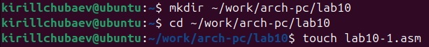
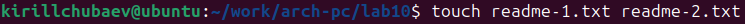

2. Далее ввел в файл lab10-1.asm код программы, создал исполняемый файл и запустил ее. Ответ сохранился в файле readme-1.txt. С помощью команды cat я проверил правильность выполнения программы:

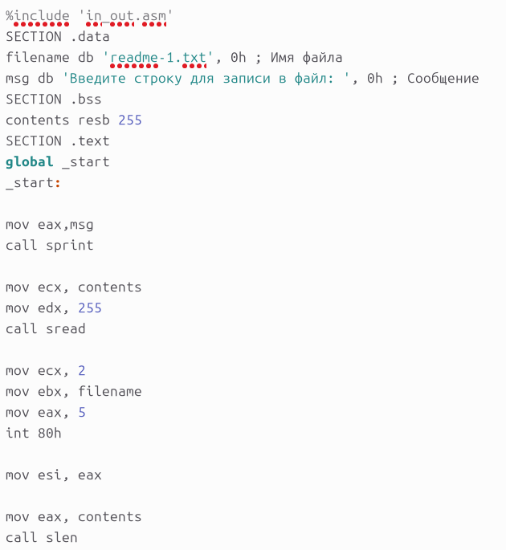
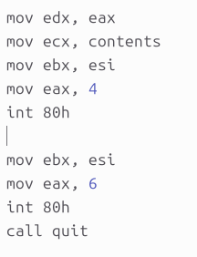
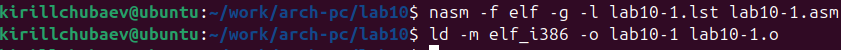
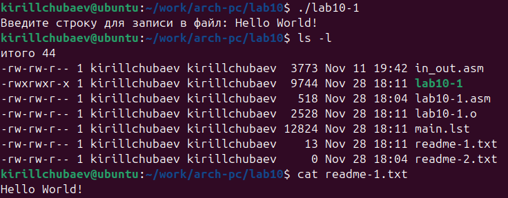

3. Затем помощью команды сhmod я запретил доступ для выполнения программы. В терминале вывелся ожидаемый результат: отказ в доступе, так как я запретил запускать программу для владельца:

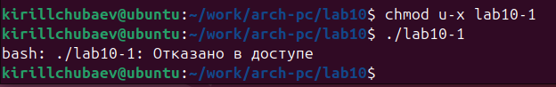

4. С помощью той же команды я дал разрешение на исполнение файлу с исходным текстом и перекомпилировал программу. 

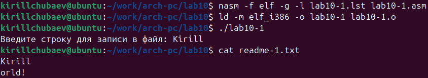

В результате она заработала, но переписала исходный текст под новый, так как этот файл уже был со всеми разрешениями, и до этого я запретил выполняться уже готовой программе. Система считает, что фактически это новая программа, хотя она обладает другими разрешениями.

5. Далее я предоставил определенные права файлу readme-1.txt в символьном виде:

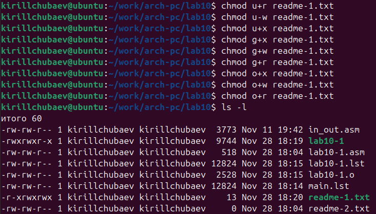

И файлу readme-2.txt в двоичном виде:

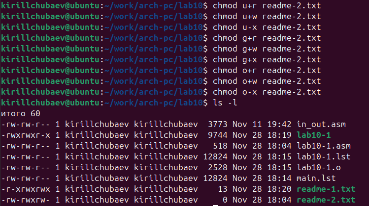

Я выполнял задание в соответствии с вариантом 14, так как я получил этот вариант в лабораторной работе №6.

# Выполнение самостоятельной работы

1. Сначала я создал файл для выполнения самостоятельной работы под названием lab10-test.asm:

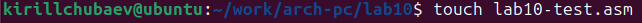

2. Далее я написал код для программы, которая будет запрашивать имя и выводить его в созданном файле name.txt, который создаст сама программа:

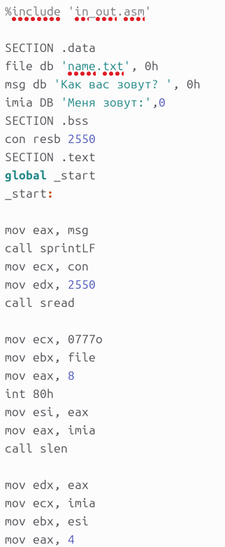
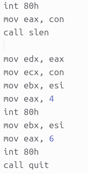

3. Создал исполняемый файл и запустил его. Программа ждала ввода моего имени в терминал, а затем создала файл с моим именем. С помощью команд cat и ls я проверил наличие файла, его содержимое и правильность выполнения своей программы:

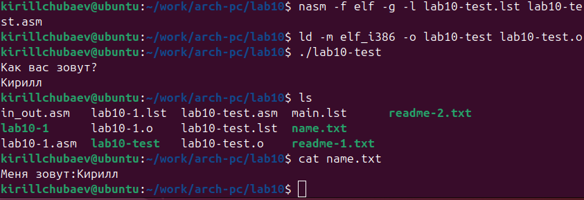

# Вывод

В ходе выполнения данной лабораторной работы я приобрел полезные навыки написания программ для работы с файлами в ассемблере NASM.

# Список литературы

1\. GDB: The GNU Project Debugger. — URL: https://www.gnu.org/software/gdb/.

2\. GNU Bash Manual. — 2016. — URL: https://www.gnu.org/software/bash/manual/.

3\. Midnight Commander Development Center. — 2021. — URL: https://midnight-commander.org/.

4\. NASM Assembly Language Tutorials. — 2021. — URL: https://asmtutor.com/.

5\. *Newham C.* Learning the bash Shell: Unix Shell Programming. — O’Reilly Media, 2005. — 354 с. — (In a Nutshell). — ISBN 0596009658. — URL: http://www.amazon.com/Learningbash-Shell-Programming-Nutshell/dp/0596009658.

6\. *Robbins A.* Bash Pocket Reference. — O’Reilly Media, 2016. — 156 с. — ISBN 978-1491941591.

7\. The NASM documentation. — 2021. — URL: https://www.nasm.us/docs.php.

8\. *Zarrelli G.* Mastering Bash. — Packt Publishing, 2017. — 502 с. — ISBN 9781784396879.

9\. *Колдаев В. Д.*, *Лупин С. А.* Архитектура ЭВМ. — М. : Форум, 2018.

10\. *Куляс О. Л.*, *Никитин К. А.* Курс программирования на ASSEMBLER. — М. : Солон-Пресс, 2017.

11\. *Новожилов О. П.* Архитектура ЭВМ и систем. — М. : Юрайт, 2016.

12\. Расширенный ассемблер: NASM. — 2021. — URL: https://www.opennet.ru/docs/RUS/nasm/.

13\. *Робачевский А.*, *Немнюгин С.*, *Стесик О.* Операционная система UNIX. — 2-е изд. — БХВ-Петербург, 2010. — 656 с. — ISBN 978-5-94157-538-1.

14\. *Столяров А.* Программирование на языке ассемблера NASM для ОС Unix. — 2-е изд. — М. : МАКС Пресс, 2011. — URL: http://www.stolyarov.info/books/asm\_unix.

15\. *Таненбаум Э.* Архитектура компьютера. — 6-е изд. — СПб. : Питер, 2013. — 874 с. — (Классика Computer Science).

16\. *Таненбаум Э.*, *Бос Х.* Современные операционные системы. — 4-е изд. — СПб. : Питер, 2015. — 1120 с. — (Классика Computer Science).

